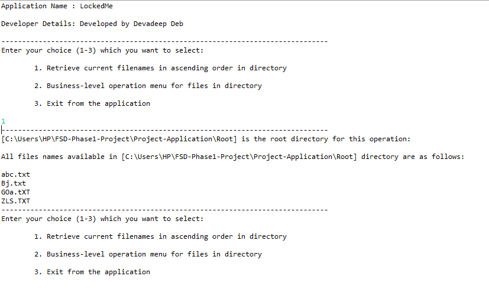
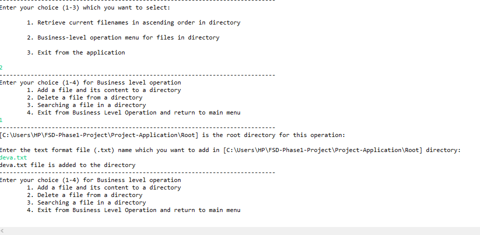
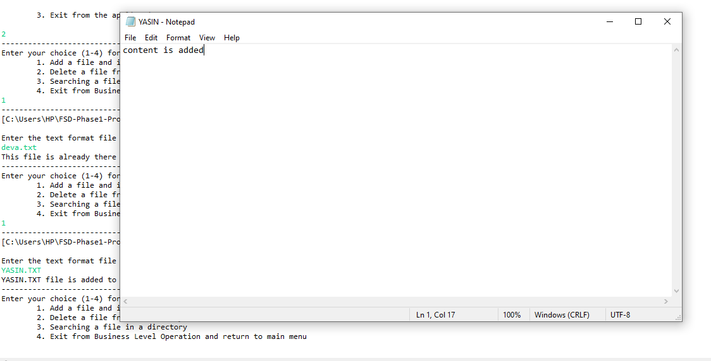
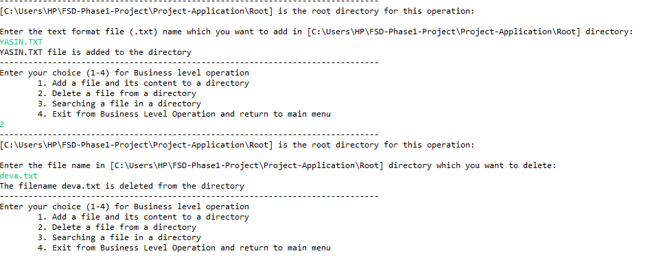
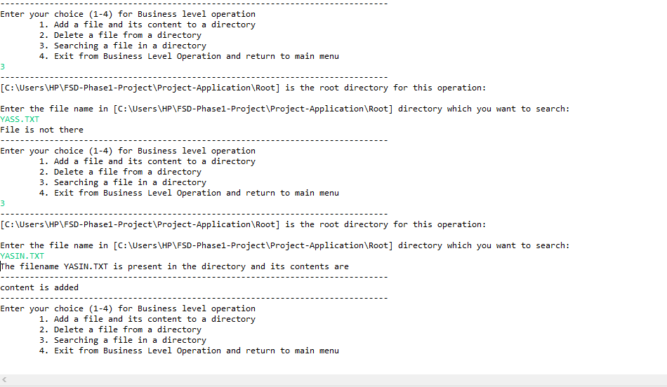
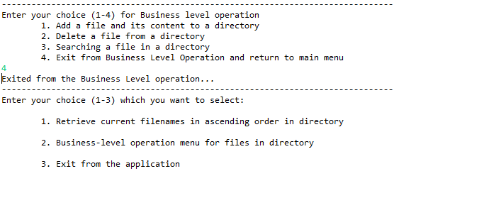
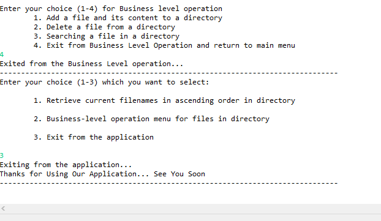
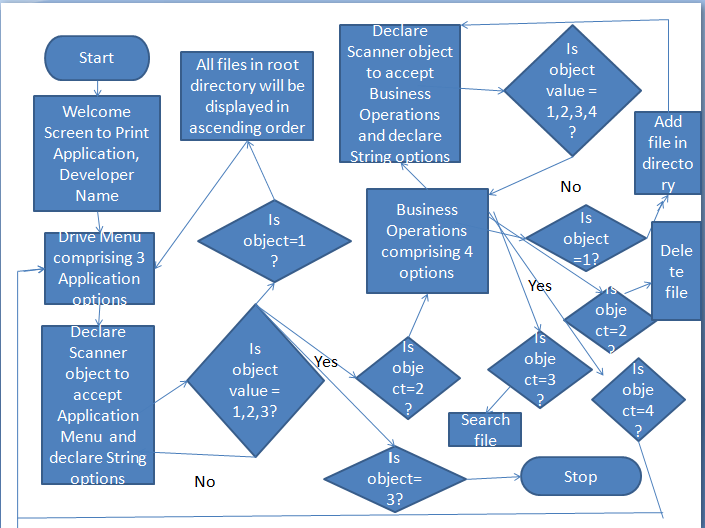

# Project-Application
LockedMe
<h1>Output</h1>
<h3>Code to display the welcome screen. It should display:</h3>
<h2>Output 1</h2>

Main application window: Application name and the developer details

The details of the user interface such as options displaying the user interaction information

Features to accept the user input to select one of the 3 options listed.

The first option returns the current file names in ascending order. The root directory can be either empty or contain few files or folders in it.

<h1>Output 2</h1>

Business-level operations window:

Option to add a user specified file to the application

Option to delete a user specified file from the application

Option to search a user specified file from the application

Navigation option to close the current execution context and return to the main context

<h1>Output 3</h1>

Option to add a user specified file to the application and add contents to it.(Desktop.getDesktop().edit(file) opens the file for adding content on Notepad. It only works in Windows and not in linux OS).

<h1>Output 4</h1>

Delete a user specified file from the existing directory list

<h1>Output 5</h1>

Search a user specified file from the main directory

Displayed the result upon successful operation

Displayed the result upon unsuccessful operation

<h1>Output 6</h1>

Option to navigate back to the main context from Business Level Operation

<h1>Output 7</h1>

Third option to close the main application

<h1>Application Algorithm</h1>

1) Start

2) Welcome Screen to Print Application, Developer Name

3) Drive Menu comprising 3 Application options 

4) Declare Scanner object to accept Application Menu  and declare String options 

5) Is object value = 1,2,3?

6a) If No, return to 3) and continue.

6b) If Yes, Go to any step from 6b1)-6b3)

   6b1) Option 1 -> Display files in ascending order -> return to 3) and continue.

  6b2) Option 2 -> Business Operations comprising 4 options and go to 7)

  6b3) Option 3 -> Go to 10) end

7) Declare Scanner object to accept Business  Operations  and declare String options 

8) Is object value = 1,2,3,4?

9a) If No, return to 6b2) and continue.

9b) If Yes, Go to any step from 9b1)-9b4)

   9b1) Option 1 -> Add file -> return to 6b2) and continue.

   9b2) Option 2 -> Delete file -> return to 6b2) and continue.

   9b3) Option 3 -> Search file -> return to 6b2) and continue.

   9b4) Option 4 -> Return to 3) and continue.

10) End

<h1>Application Flowchart</h1>

<h1>Core Concepts</h1>

IDE : Eclipse Oxygen

Java Version: 1.8

Javs Concepts Used: Files, List, ArrayList, Interface, Static, Exception, If-else, Switch, Do-while, Scanner, Class, Function, Packages
